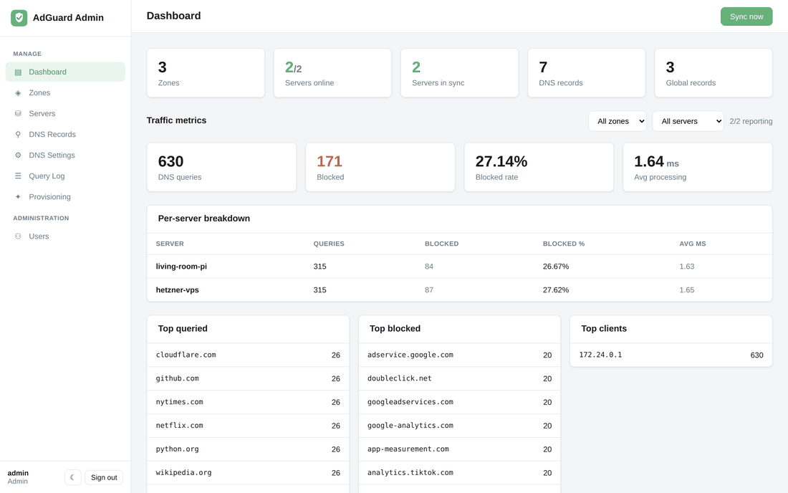
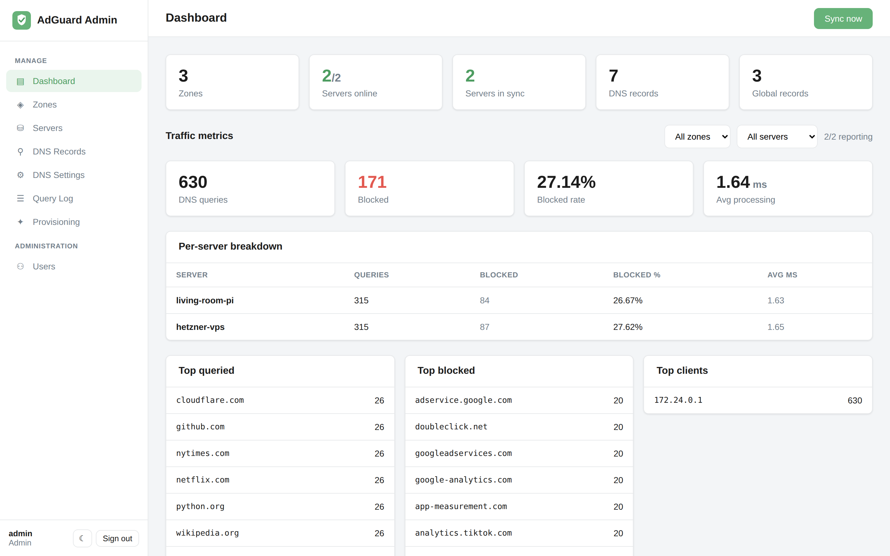
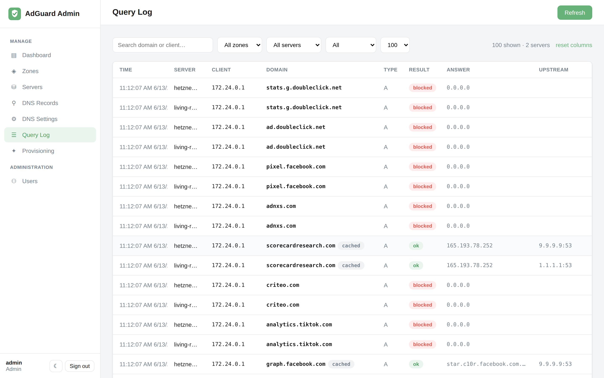
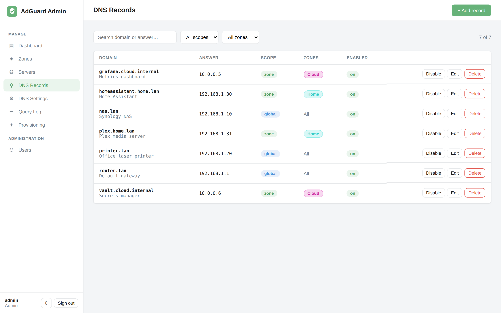
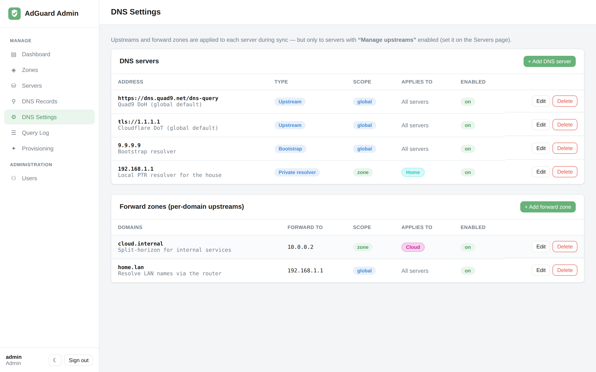
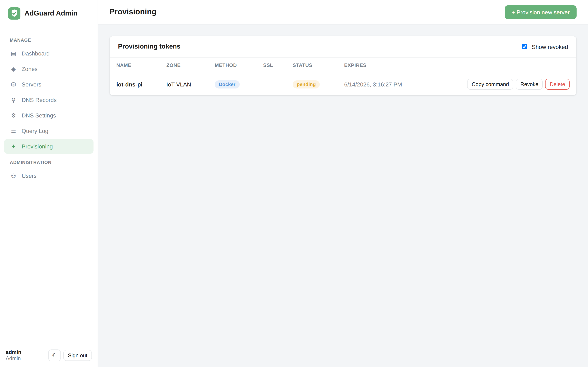

# AdGuard Admin

A fleet manager for multiple [AdGuard Home](https://github.com/AdguardTeam/AdGuardHome)
servers. The admin app is the **source of truth** for your custom DNS records: you
define them once, group your servers into zones, and the reconciliation engine
pushes the desired state to every server — automatically re-applying it whenever a
server comes back online.



> **One control plane for your whole DNS fleet** — declare records and settings once,
> and let reconciliation keep every AdGuard Home box in sync.
>
> 📖 **New here? Start with the [documentation](docs/README.md).**

## Features

- **Zones** — group servers logically (`on-prem`, `cloud`, `iot-vlan`, …).
- **DNS records** — *global* (every server) or *zone-scoped* (only servers in a zone).
- **DNS settings** — manage **upstream DNS servers** and per-domain **forward zones**
  at global / zone / server scope; opt-in per server via *Manage upstreams*.
- **Reconciliation** — a background loop diffs desired vs. actual DNS rewrites (and
  upstreams) on each server and applies the difference. Offline servers are retried
  until they converge.
- **Import** — pull a server's existing rewrites *and* upstream config into the admin DB.
- **Provisioning** — one-line, token-based install of new servers (Docker or bare-metal)
  with optional server-side TLS cert.
- **Dashboard metrics** — combined query/blocked stats across the fleet, filterable by
  zone and server.
- **Users & RBAC** — `admin` / `editor` / `viewer` roles.
- **OIDC / Authentik** — single sign-on alongside local accounts.
- **Stack** — single-container FastAPI + SQLModel backend serving a Vue 3 SPA styled
  after AdGuard Home.

## Screenshots

|  |  |
|---|---|
| **Dashboard** — fleet-wide query/blocked metrics | **Query log** — combined, searchable, per-server |
| [](docs/images/dashboard.png) | [](docs/images/query-log.png) |
| **DNS records** — global & zone-scoped rewrites | **DNS settings** — upstreams & forward zones |
| [](docs/images/records.png) | [](docs/images/dns-settings.png) |
| **Servers** — status, version, sync state | **Provisioning** — one-line server installs |
| [](docs/images/servers.png) | [](docs/images/provision.png) |

## Documentation

Full guides live in [`docs/`](docs/README.md):

| Guide | What it covers |
|---|---|
| [Getting started](docs/getting-started.md) | Run with Docker, log in, add your first server |
| [Core concepts](docs/concepts.md) | Source-of-truth, zones, scopes, reconciliation, prune |
| [Zones & DNS records](docs/zones-and-records.md) | Grouping servers and managing rewrites |
| [Servers](docs/servers.md) | Adding, testing, importing, per-server behavior |
| [DNS settings](docs/dns-settings.md) | Upstream resolvers and forward zones |
| [Provisioning](docs/provisioning.md) | One-line install of new AdGuard servers |
| [Dashboard & query log](docs/dashboard-and-query-log.md) | Fleet metrics and the combined query log |
| [Users & SSO](docs/users-and-sso.md) | Roles and OIDC / Authentik login |
| [Configuration reference](docs/configuration.md) | Every environment variable |

## How the source-of-truth model works

For each enabled server, its **desired** rewrite set is:

```
desired(server) = { enabled global records } ∪ { enabled records in server.zone }
```

The engine reads the server's current DNS rewrites (`/control/rewrite/list`), adds
anything missing, and — only if **prune** is enabled for that server — removes
rewrites that aren't in the desired set. Prune is **off by default**, so the app
never deletes records it didn't create unless you opt in per server.

## Quick start (Docker)

The whole app ships as a **single container**: a multi-stage build compiles the
Vue SPA and bakes it into the FastAPI image, which serves both the UI and the API
on one port.

```bash
cd adguard-admin
cat > .env <<EOF
SECRET_KEY=$(python3 -c "import secrets; print(secrets.token_urlsafe(48))")
FERNET_KEY=$(python3 -c "from cryptography.fernet import Fernet; print(Fernet.generate_key().decode())")
ADMIN_USERNAME=admin
ADMIN_PASSWORD=change-me
PUBLIC_BASE_URL=http://localhost:8080
FRONTEND_URL=http://localhost:8080
CORS_ORIGINS=http://localhost:8080
EOF

docker compose up --build
```

Everything is served on **<http://localhost:8080>**:

- UI: <http://localhost:8080>
- API docs: <http://localhost:8080/docs>

Log in with the bootstrap admin and **change the password immediately** (Users page).

## Local development

**Backend**

```bash
cd backend
python3 -m venv .venv && source .venv/bin/activate
pip install -r requirements.txt
cp .env.example .env          # then fill in SECRET_KEY and FERNET_KEY
uvicorn app.main:app --reload
```

**Frontend**

```bash
cd frontend
npm install
npm run dev                   # http://localhost:5173, proxies /api to :8000
```

## OIDC / SSO

AdGuard Admin supports OpenID Connect single sign-on (tested with Authentik) alongside
local accounts, with optional group→role mapping. See
[Users & SSO](docs/users-and-sso.md) for the full setup, and the
[configuration reference](docs/configuration.md#oidc--authentik) for every variable.

## Security notes

- AdGuard server passwords are encrypted at rest with `FERNET_KEY`. The backend
  refuses to store them if the key is unset.
- JWTs are signed with `SECRET_KEY`; decode pins the algorithm to prevent
  algorithm-confusion attacks.
- Dependency versions are pinned to patched releases — see `backend/requirements.txt`
  for the CVEs each pin addresses (python-jose→PyJWT, passlib→pwdlib, Authlib ≥1.7.2,
  Starlette ≥1.0.1).

## API overview

| Method | Path | Role | Purpose |
|---|---|---|---|
| POST | `/api/auth/token` | — | Local login (returns JWT) |
| GET | `/api/auth/oidc/login` | — | Start OIDC flow |
| GET | `/api/stats` | viewer | Dashboard counters |
| CRUD | `/api/zones` | editor | Manage zones |
| CRUD | `/api/servers` | editor | Manage servers (`/test` probes a server) |
| CRUD | `/api/records` | editor | Manage DNS records |
| POST | `/api/sync/run[/{id}]` | editor | Trigger reconciliation |
| CRUD | `/api/users` | admin | Manage users |
```
