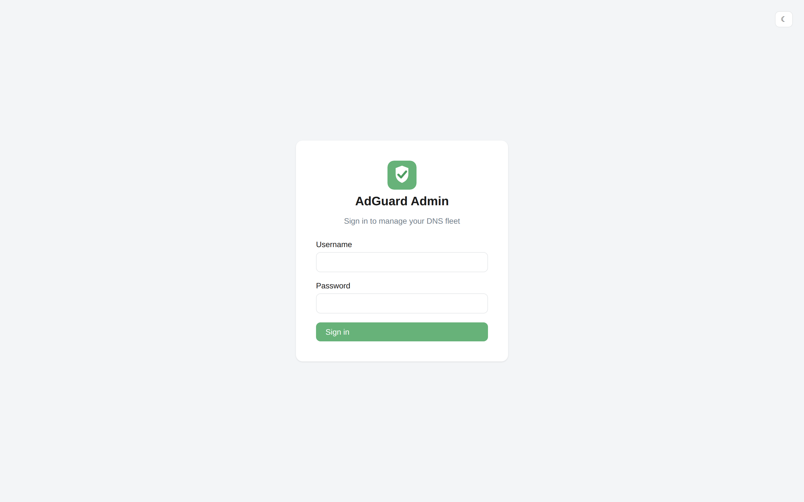
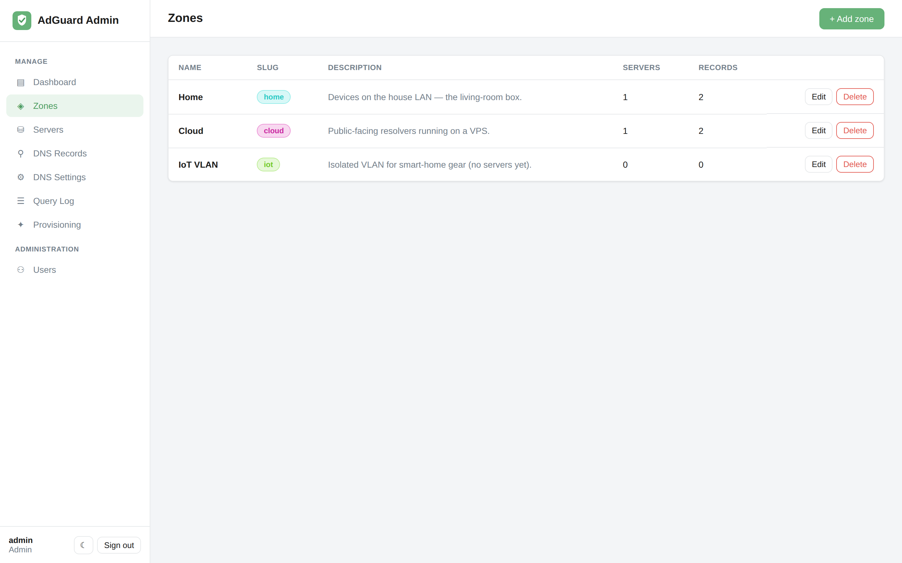

# Getting started

This walks you from nothing to a running control plane with your first AdGuard Home
server under management.

## 1. Run the app (Docker)

The whole app ships as a **single container** — a multi-stage build compiles the Vue
SPA and bakes it into the FastAPI image, which serves both the UI and the API on one
port.

```bash
git clone <this-repo> adguard-admin
cd adguard-admin

cat > .env <<EOF
SECRET_KEY=$(python3 -c "import secrets; print(secrets.token_urlsafe(48))")
FERNET_KEY=$(python3 -c "from cryptography.fernet import Fernet; print(Fernet.generate_key().decode())")
ADMIN_USERNAME=admin
ADMIN_PASSWORD=change-me
PUBLIC_BASE_URL=http://localhost:8080
FRONTEND_URL=http://localhost:8080
CORS_ORIGINS=http://localhost:8080
EOF

docker compose up --build
```

Everything is served on **<http://localhost:8080>**:

- **UI** — <http://localhost:8080>
- **API docs** (OpenAPI/Swagger) — <http://localhost:8080/docs>

`SECRET_KEY` signs login tokens; `FERNET_KEY` encrypts your AdGuard server passwords at
rest. Both are required — see the [configuration reference](configuration.md).

## 2. Log in



Sign in with the bootstrap admin you set in `.env` (`ADMIN_USERNAME` /
`ADMIN_PASSWORD`). **Change the password immediately** from the *Users* page, or create
a fresh admin and disable the bootstrap one.

The bootstrap account is only created on first start, when the database has no users.

## 3. Create a zone

[Zones](concepts.md#zones) group servers logically. Even if you only have one server,
make a zone — it keeps records tidy as you grow.

Go to **Zones → + Add zone** and create something like `home`.



## 4. Add a server

You have two paths:

- **Already running AdGuard Home?** Go to **Servers → + Add server** and point it at the
  server's URL (e.g. `http://192.168.1.2:3000`) with its admin credentials. See
  [Servers](servers.md).
- **Starting from scratch?** Use [Provisioning](provisioning.md) to install a fresh
  AdGuard Home with a single copy-paste command.


When a server is reachable you'll see it go **online**, with its AdGuard version and
sync state.

## 5. Add a DNS record

Go to **DNS Records → + Add record**, e.g. `nas.lan → 192.168.1.10`, scope **global**.
Within one [reconciliation](concepts.md#reconciliation) cycle (default 60s, or hit
**Sync now**) it's pushed to every server.


That's it — you now have a control plane. From here:

- Add [DNS settings](dns-settings.md) (upstreams, forward zones).
- Watch traffic on the [dashboard and query log](dashboard-and-query-log.md).
- Invite teammates with scoped [roles](users-and-sso.md).

## Local development

**Backend**

```bash
cd backend
python3 -m venv .venv && source .venv/bin/activate
pip install -r requirements.txt
cp .env.example .env          # then fill in SECRET_KEY and FERNET_KEY
uvicorn app.main:app --reload
```

**Frontend**

```bash
cd frontend
npm install
npm run dev                   # http://localhost:5173, proxies /api to :8000
```
