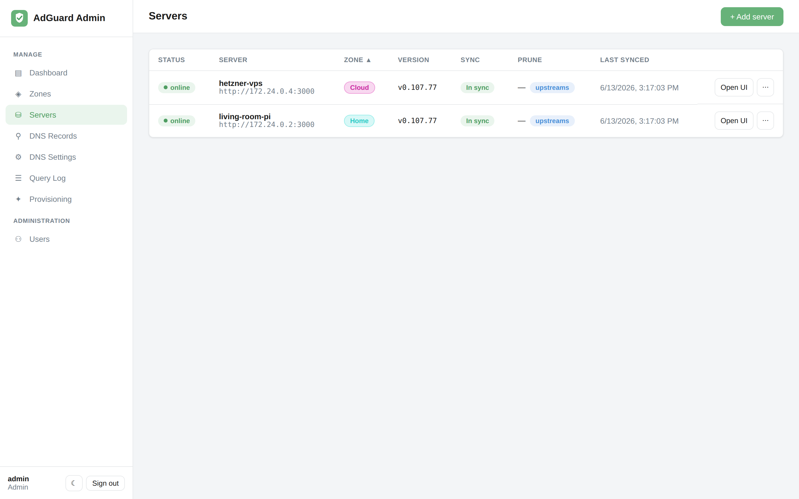

# Servers

The **Servers** page is your fleet at a glance: status, AdGuard version, sync state, and
which zone each box belongs to.

## Adding an existing server

**Servers → + Add server**, then provide:

- **Name** — a friendly label (`living-room-pi`, `hetzner-vps`).
- **URL** — the AdGuard Home admin URL, e.g. `http://192.168.1.2:3000` or
  `https://dns.example.com`.
- **Username / password** — the server's AdGuard admin credentials. The password is
  **encrypted at rest** with your `FERNET_KEY` and never returned to the browser.
- **Zone** — which [zone](concepts.md#zones) this server joins.
- **Options** — *Enabled*, *Prune*, *Manage upstreams* (see below).

Use **Test** to probe connectivity and credentials before saving. Once saved and
reachable, the server flips to **online** and starts receiving the desired state.

> Starting from scratch with no AdGuard Home installed yet? Use
> [Provisioning](provisioning.md) instead — it installs and registers the server for you.

## Status & sync columns

- **Status** — `online`, `offline`, `error`, or `unknown`, based on the last contact.
- **Version** — the AdGuard Home version reported by the server; an *update available*
  hint appears when a newer release exists.
- **Sync** — whether the server's rewrites currently match the desired state.
- **Last synced** — when the engine last reconciled this server.

## Per-server options

| Option | Effect |
|---|---|
| **Enabled** | When off, the server is ignored by the reconciliation engine (no pushes, no metrics). |
| **Prune** | When on, the engine *removes* rewrites that aren't in the desired set, mirroring the admin DB exactly. Off by default — see [prune](concepts.md#prune). |
| **Manage upstreams** | When on, the server also receives [DNS settings](dns-settings.md) (upstream resolvers and forward zones). When off, the server keeps its own DNS config. |

## Importing existing config

Adopting a server that already has records or upstreams? Use **import** (from the
server's row menu):

- **Import records** pulls the server's existing DNS rewrites into the admin DB so they
  become managed going forward.
- **Import settings** pulls the server's upstream/forward-zone configuration in.

This lets you onboard a hand-configured server without retyping everything — and without
risking deletion, since [prune](concepts.md#prune) stays off until you enable it.

## Per-server sync & the AdGuard UI

Each server row lets you **sync just that server** on demand and **Open UI** to jump
straight into that box's native AdGuard Home interface when you need something the fleet
manager doesn't cover.
