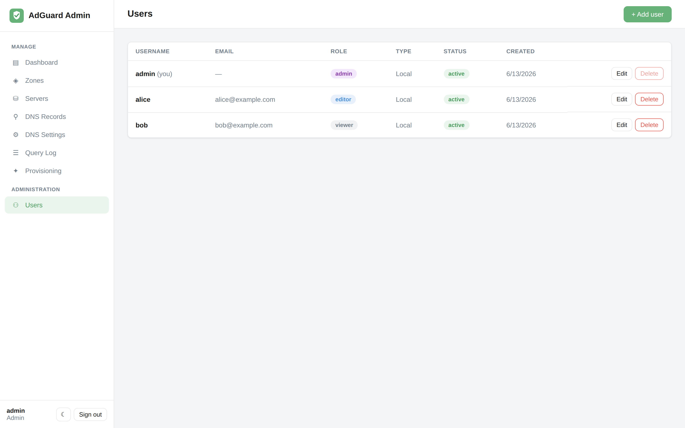

# Users & SSO

## Roles

AdGuard Admin has three roles, enforced on every API call:

| Role | Can do |
|---|---|
| **admin** | Everything, including managing users |
| **editor** | Manage zones, servers, records, DNS settings; trigger sync and provisioning |
| **viewer** | Read-only — dashboards, query log, and configuration, but no changes |

Manage accounts from the **Users** page (admins only).



Each user shows their **role**, **type** (Local or OIDC), **status**, and creation date.
You can edit a user's role/email, deactivate them, or reset a local user's password. The
account you're signed in as is marked **(you)** and can't delete itself.

## Local accounts

The first time the app starts with an empty database, a **bootstrap admin** is created
from `ADMIN_USERNAME` / `ADMIN_PASSWORD`. Log in, then:

- change its password immediately, **or**
- create your own admin and deactivate the bootstrap account.

Passwords are hashed; login issues a signed JWT (`SECRET_KEY`) whose algorithm is pinned
on decode to prevent algorithm-confusion attacks.

## OIDC / Authentik SSO

AdGuard Admin supports OpenID Connect single sign-on (tested with
[Authentik](https://goauthentik.io/)) **alongside** local accounts.

### 1. Configure your IdP

Create an **OAuth2 / OpenID Provider** + Application:

- **Redirect URI**: `<public-base-url>/api/auth/oidc/callback`
  (e.g. `http://localhost:8080/api/auth/oidc/callback`)
- **Scopes**: `openid email profile` (add a `groups` claim if you want group→role
  mapping).

### 2. Configure the app

In `.env`:

```ini
OIDC_ENABLED=true
OIDC_ISSUER=https://authentik.example.com/application/o/<app-slug>/
OIDC_CLIENT_ID=...
OIDC_CLIENT_SECRET=...
OIDC_REDIRECT_URI=http://localhost:8080/api/auth/oidc/callback
OIDC_ADMIN_GROUP=adguard-admins     # optional: members become admins
OIDC_DEFAULT_ROLE=viewer            # role for first-time SSO users
```

### 3. Sign in

The login screen gains a **Sign in with Authentik** button. First-time SSO users are
provisioned automatically with `OIDC_DEFAULT_ROLE` (or **admin** if they're in
`OIDC_ADMIN_GROUP`). After authenticating, the token is handed to the SPA via the URL
fragment so it never lands in server logs.

See the [configuration reference](configuration.md#oidc--authentik) for every OIDC
setting.
